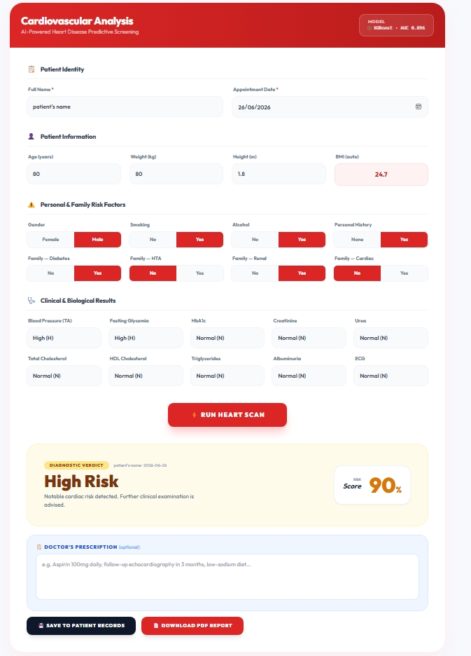
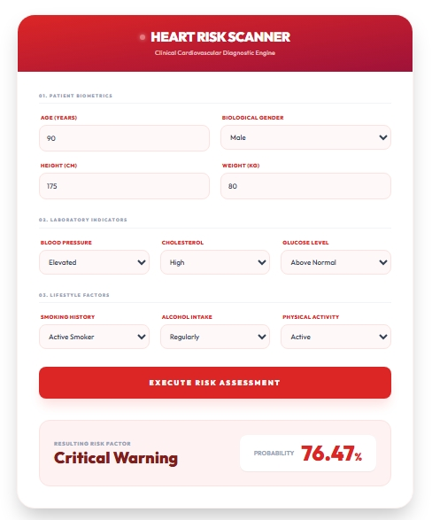
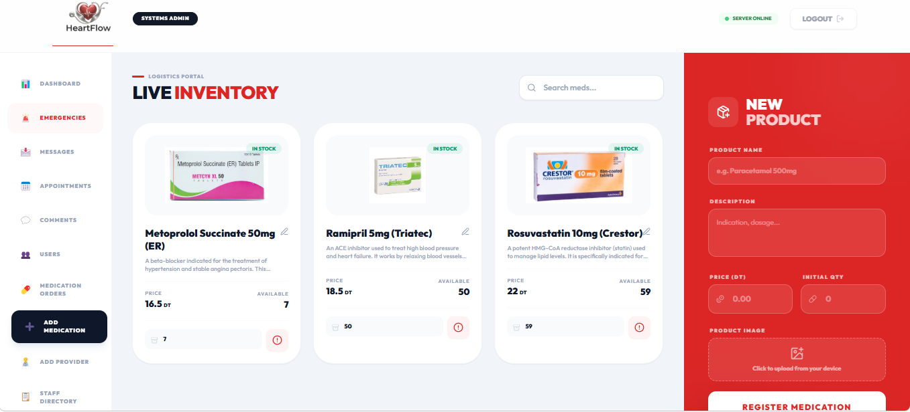
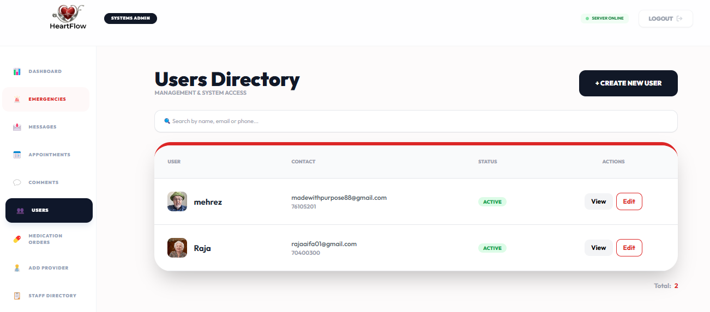

#  HeartFlow

**A full-stack smart healthcare platform (MERN + Flask) with AI-based risk prediction for heart disease and diabetes, appointment scheduling, medication tracking with AI prescription extraction, and emergency alerts.**

[](https://heartflow.onrender.com)
[](https://heartflow-admin.onrender.com)

---

## 🌐 Live Demo

| App | URL |
|---|---|
| Patient application | https://heartflow.onrender.com |
| Admin / Doctor dashboard | https://heartflow-admin.onrender.com |
| Backend API | https://heartflow-api.onrender.com |
| ML prediction API | https://heartflow-ml.onrender.com |

> ⏳ The project is hosted on free tiers. After a period of inactivity the services go to sleep, so the **first request can take about 50 seconds**. Open the backend and ML URLs once to wake them up, then use the apps normally.
## 🔑 Demo Accounts

| Role | Where to log in | Email | Password |
|---|---|---|---|
| Admin | https://heartflow-admin.onrender.com | demo.admin@heartflow.com | DEMO_PASSWORD |


> These are throwaway accounts for testing only. Please do not enter real personal or medical data. The first load can take about 50 seconds while the free servers wake up.
---

## 📖 Overview

HeartFlow combines core hospital-workflow features with AI-driven diagnostics. It supports three user roles (**patients, doctors and admins**) and includes:

- 📅 Appointment scheduling and management
- 🫀 AI-based risk prediction for **heart disease** and **diabetes** (RandomForest / XGBoost models)
- 💊 Medication store with order tracking and **AI-powered prescription extraction** from uploaded images (vision LLM)
- 🥗 AI-generated personalized diet plans (LLaMA 3.3 via the Groq API)
- 🤖 Medical chatbot assistant
- 🚨 Emergency alerts
- 👥 User management for patients, doctors and admins

Built as a **graduation capstone project**, HeartFlow demonstrates end-to-end system design, from clinical data preprocessing and ML model deployment to a full-featured, multi-role web application.

---

## 🛠️ Technologies Used

| Layer | Technology |
|---|---|
| Frontend | React (Vite), Tailwind CSS |
| Backend | Node.js, Express.js |
| ML microservice | Python, Flask, Gunicorn |
| Database | MongoDB (Mongoose) / MongoDB Atlas |
| Authentication | JWT (custom middleware) |
| Machine Learning | scikit-learn (RandomForest), XGBoost, imbalanced-learn (SMOTE), pandas, NumPy |
| AI integrations | Groq API (vision model for prescription extraction, `llama-3.3-70b-versatile` for chatbot and diet plans) |
| File uploads | Multer, Cloudinary |
| Email | Nodemailer (password reset) |
| Hosting | Render (static sites + web services), MongoDB Atlas |

---

## 🏗️ Architecture

The system runs as four coordinated parts:

| Service | Tech | Local port |
|---|---|---|
| Backend API | Express.js | 5000 |
| ML Prediction API | Flask | 5001 |
| Patient frontend | React (Vite) | 5173 |
| Admin / doctor dashboard | React (Vite) | 5174 |

```text
 Patient app (React)        Admin / Doctor app (React)
        │                              │
        └──────────────┬───────────────┘
                       ▼
             Backend API (Express)  ───►  MongoDB Atlas
                │          │
                │          └──►  Groq API (chatbot, diet plans, prescription OCR)
                ▼
      ML Prediction API (Flask)
      RandomForest / XGBoost models
```

The AI call used for prescription extraction goes through the backend (`/api/groq/chat`), so the Groq API key never reaches the browser.

---

## 📁 Project Structure

```text
HeartFlow/
├── backend/      # Express API, JWT auth, Mongoose models, controllers, routes
├── ml-model/     # Flask ML microservice: preprocessing, training, evaluation, models
├── frontend/     # React patient-facing app
├── admin/        # React admin and doctor dashboard
└── README.md
```

---

## 🧠 Machine Learning Pipeline

- Four predictive models (patient and doctor variants for heart disease and diabetes)
- Algorithms: **RandomForest** and **XGBoost**
- **SMOTE** for class balancing through `imbalanced-learn` pipelines
- The doctor-side heart dataset is a structured clinical dataset (92 patients) preprocessed from handwritten records into Excel format
- Evaluation artifacts (confusion matrices, ROC and PR curves, feature importance) are available in `ml-model/`

---

## 🚀 Run Locally

### Prerequisites

- Node.js 18+ and npm
- Python 3.10+
- A MongoDB instance (local or Atlas connection string)
- A Groq API key
- A Cloudinary account (image uploads)

### 1. Clone the project

```bash
git clone https://github.com/RajaAifa/HeartFlow.git
cd HeartFlow
```

### 2. Backend (Express)

```bash
cd backend
npm install
```

Create `backend/.env`:

```env
PORT=5000
MONGODB_URI=your_mongodb_connection_string
JWT_SECRET=your_long_random_secret

ADMIN_EMAIL=admin@example.com
ADMIN_PASSWORD=choose_a_strong_password

CLOUDINARY_NAME=your_cloud_name
CLOUDINARY_API_KEY=your_api_key
CLOUDINARY_SECRET_KEY=your_api_secret

GROQ_API_KEY=your_groq_api_key

EMAIL_USER=your_email@gmail.com
EMAIL_PASS=your_gmail_app_password

FLASK_AI_URL=http://127.0.0.1:5001
BACKEND_URL=http://localhost:5000
FRONTEND_URL=http://localhost:5173
ADMIN_URL=http://localhost:5174
```

Create the first admin account, then start the server:

```bash
node seeds/adminSeeder.js
npm run server
```

The API runs on `http://localhost:5000`.

### 3. ML microservice (Flask)

```bash
cd ml-model
python -m venv .venv
source .venv/bin/activate        # Windows: .venv\Scripts\activate
pip install -r requirements.txt
python app.py
```

The prediction service runs on `http://localhost:5001`.

### 4. Patient frontend (React)

Create `frontend/.env`:

```env
VITE_BACKEND_URL=http://localhost:5000
VITE_ML_URL=http://localhost:5001
VITE_AI_URL=http://localhost:5001
VITE_ADMIN_URL=http://localhost:5174
```

```bash
cd frontend
npm install
npm run dev
```

### 5. Admin / doctor dashboard (React)

Create `admin/.env`:

```env
VITE_BACKEND_URL=http://localhost:5000
VITE_FRONTEND_URL=http://localhost:5173
VITE_CURRENCY=DT
```

```bash
cd admin
npm install
npm run dev
```

---

## 🔐 Authentication Notes

HeartFlow uses custom JWT middleware:

- Admin routes expect the token in the `atoken` header
- Patient routes expect the token in the `token` header
- No `Bearer` prefix is used on these headers

---

## ☁️ Deployment

| Part | Platform | Settings |
|---|---|---|
| Database | MongoDB Atlas (M0) | Network access allows Render |
| ML service | Render Web Service | Root `ml-model`, build `pip install -r requirements.txt`, start `gunicorn app:app --workers 1 --timeout 120` |
| Backend | Render Web Service | Root `backend`, build `npm install`, start `npm start` |
| Patient app | Render Static Site | Root `frontend`, build `npm install && npm run build`, publish `dist` |
| Admin app | Render Static Site | Root `admin`, build `npm install && npm run build`, publish `dist` |

For both static sites, add a rewrite rule `/*` → `/index.html` so refreshing a page works. On the backend, `FRONTEND_URLS` must contain the two site URLs (comma-separated, no spaces) so that CORS allows them.

---

## 📸 Screenshots

| Doctor risk prediction | Patient risk prediction |
|---|---|
|  |  |

| Medication store | Admin dashboard (users) |
|---|---|
|  |  |

## ⚠️ Disclaimer

HeartFlow is an educational project built for a graduation capstone. Its predictions and AI-generated content are **not** medical advice and must not replace consultation with a qualified healthcare professional.

---

## 👩‍💻 Author

**Raja Aifa**

🎓 Professional Master's Degree in Web Services and Multimedia, Tunisia

---

## 📜 License

This project is intended for educational and research purposes. If you reuse or modify it, make sure to comply with the licenses of the libraries, frameworks, models and datasets it relies on.
